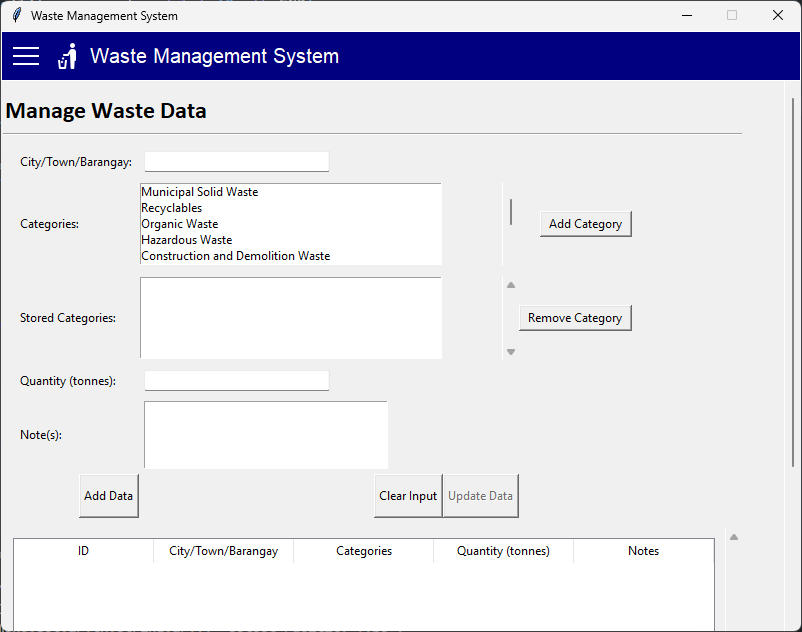
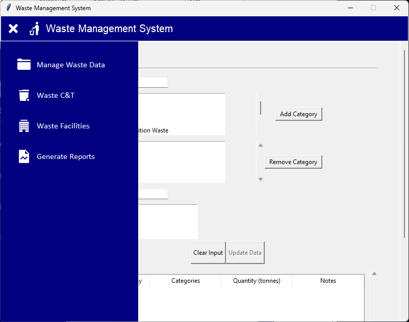
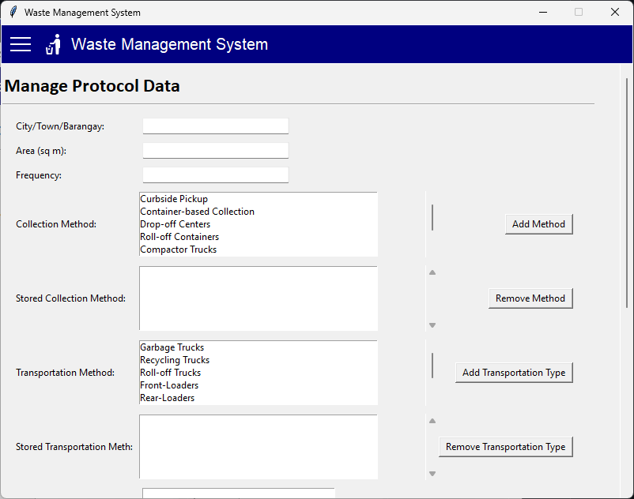
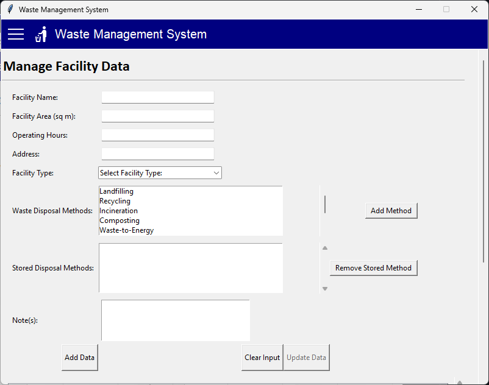
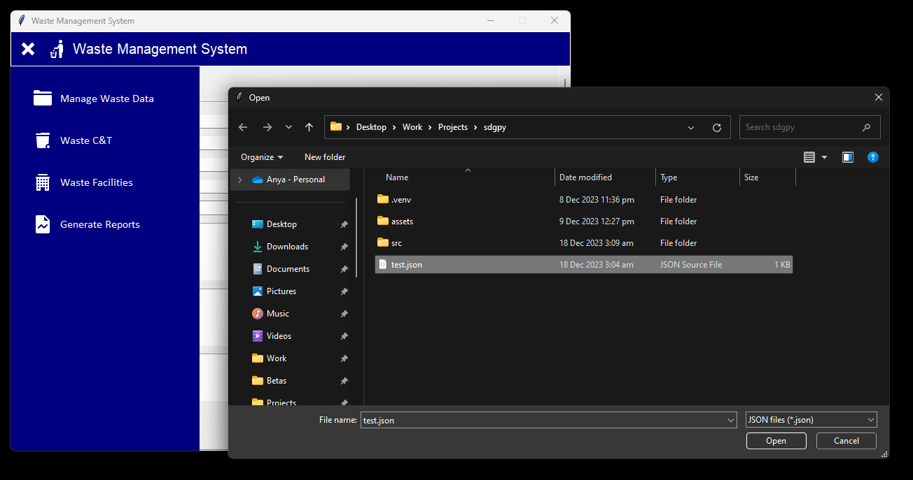
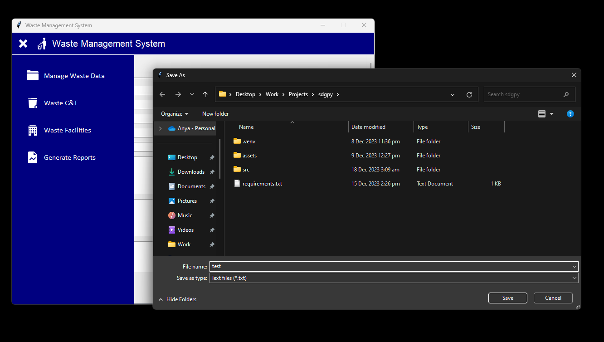
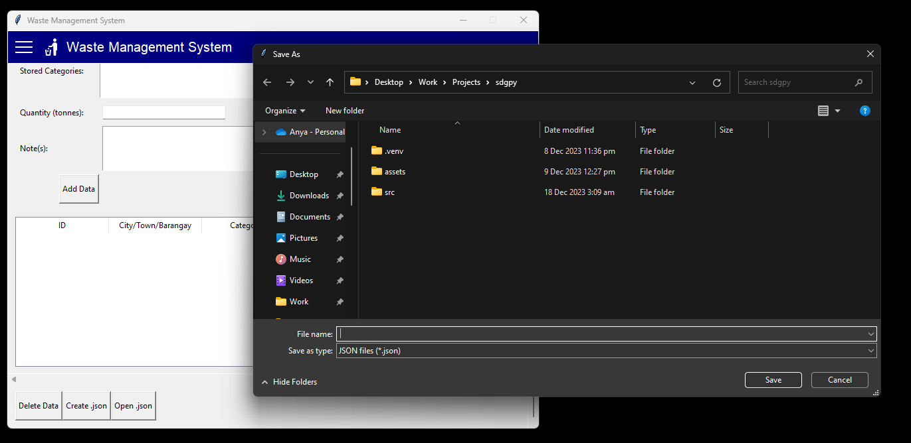
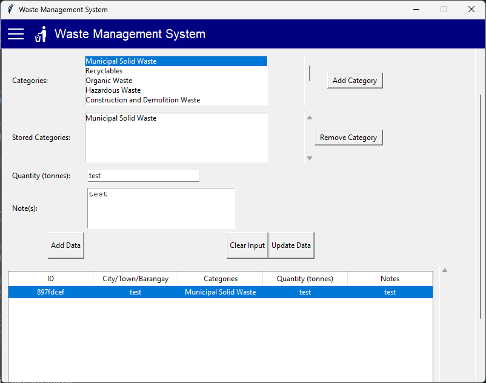
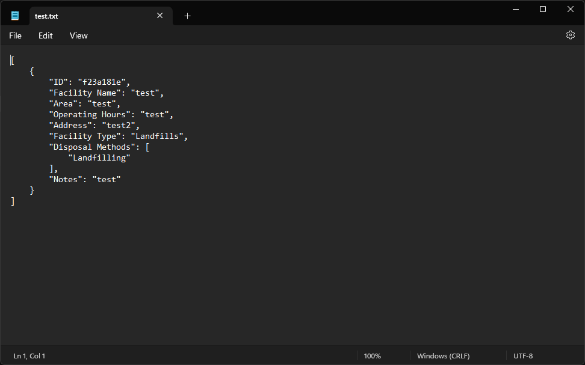

<h1>sdg-py</h1> 
An extremely basic Waste Management System using Tkinter.

# Project Description

This `sdg-py` project was created to fulfill academic requirements in CS 121, and in accordance with Sustainable Development Goals #12/#13 *(Responsible Consumption and Production/Climate Action)*

# Features and Screenshots 

- Create and Manage Waste Profiles

- Toggle Menu

- Create and Manage Waste Collection and Transportation Protocols

- Create and Manage Facility and Disposal Profiles

- Export json files as txt files or load json files

- Table selection

- Sample .txt output

# Technologies and Programs Used

- Python
- Tkinter
- VS Code

# Prerequisites

- Python

# Group Members

| Sr-Code | Group Member                  |
| ------- | ----------------------------- |
| 21-03359      | Shane Jo-Anne Bacay           |
| 22-01051         | Aethelbelle Cabatay           |
| 21-06333        | Angel Anya Leona Delos Reyes  |
| 21-02563         | Lenard Josh Delos Reyes       |

# Documentation

## Project Overview

The `sdg-py` project is a Waste Management System built with Python and Tkinter. It serves as an academic project to demonstrate basic functionalities related to waste management.

The Waste Facility Management Application, developed in Python using Tkinter, offers an interface for creating, editing, viewing, and deleting waste facility data. The application features a scrollable canvas, listboxes, and dynamic treeviews. Users can input essential information, including facility name, area, operating hours, address, facility type, and waste disposal methods. The data is stored in JSON format, providing portability and structure. No third-party dependencies. To run the application, execute `main.py`.

## File Structure

- `main.py`: Main application file.
- `app.py`: Application structure and layout.
- `manage_waste.py`: Manages waste profile
- `facility_waste.py`: Manages facility and disposal data.
- `waste_cat.py`: Manages collection and transportation protocols.

## How to Run the Application

Ensure that Python is installed on your system.

1. Clone the repository: `git clone https://github.com/anna-gayle/sdg-py.git`
2. Navigate to the project directory: `cd sdg-py`
3. Run the application: `python main.py`

## Code Explanation

### `main.py`

In `main.py`, the entry point for the Waste Management System application, the Tkinter library is imported for graphical user interface (GUI) creation. The script creates the main Tkinter window and instantiates the `WasteManagementApp` class from the `app` module, passing the window as an argument. The application's main event loop is initiated, ensuring responsiveness to user interactions and facilitating the seamless execution of the waste management functionalities encapsulated within the `WasteManagementApp` class.

### `app.py`

The `app.py` module defines the `WasteManagementApp` class, which serves as the core of the Waste Management System application. The class is responsible for initializing the main Tkinter window, setting its properties, and creating a menu bar with navigation buttons. It manages different frames for managing waste data, waste collection and transportation, and waste facilities. The class also includes functionality to generate reports by opening a file dialog for selecting a JSON file, converting the data, and saving it as a text file. The file also contains the `create_menu_bar` function for building the application's menu bar with toggleable buttons for different functionalities. The main block instantiates the `WasteManagementApp` class, creating an instance of the application, and starts the Tkinter main loop for user interaction.

### `manage_waste.py`

The `manage_waste.py` module introduces the `ManageWasteDataFrame` class, utilizing the Tkinter library to construct a user-friendly graphical user interface (GUI) for streamlined waste data management. The GUI is centered around a scrollable frame that hosts a `Treeview` widget, presenting waste data in a tabular format. Users have the capability to seamlessly add, edit, and delete entries, along with the flexibility to save and load data to and from a JSON file. Noteworthy features include category management, random ID generation, and an intuitively designed GUI to enhance user experience.

### `facility_waste.py`

The `WasteFacilityFrame` class within the `facility_waste.py` module is a Tkinter-based GUI tailored for effective waste facility data management. The interface, housed within a scrollable frame and incorporating a `Treeview` widget, allows users to perform essential operations such as adding, editing, and deleting entries. The module extends its functionality by enabling users to save and load data to/from a JSON file.

### `waste_cat.py`

The `WasteCatFrame` class, meticulously crafted in the `waste_cat.py` module, leverages Tkinter to create an intuitive GUI for efficient waste data management. The GUI encompasses a scrollable frame that integrates a `Treeview` widget, providing a clear tabular representation of waste data. Users can seamlessly execute operations such as adding, editing, and deleting entries, while also having the ability to save and load data to/from a JSON file. The module aims to enhance user experience by providing a visually appealing and user-friendly interface.

> Feel free to open source code to view comments.

## Dependencies

- Python 3.x
- Tkinter (usually included with Python, used for UI)

## Contributing

If you wish to contribute to the project, follow these guidelines:

1. Fork the repository.
2. Create a new branch: `git checkout -b feature-name`
3. Make your changes and commit them: `git commit -m 'Add new feature'`
4. Push to the branch: `git push origin feature-name`
5. Submit a pull request.

## Troubleshooting and Common Issues

- No reported bugs yet. Program should work as intended.

## Contact Information

For questions or support, you can reach out at: 
https://github.com/anna-gayle

# Group Member Grading and Contributions (100%)

| **Group Member**                                | **Contributions**                               | **Evaluation** |
| ------------------------------------------------- | ----------------------------------------------- | --------------- |
| **Angel Anya Leona Delos Reyes** | - Acting leader.   - Programmed most of the code.   - Debugger. | 30% |
| **Lenard Josh Delos Reyes** | - Programmed the most of the code after Angel.   - In charge of documentation. | 23% |
| **Aethelbelle Cabatay** | - Designed the GUI.   - Suggested the topic. | 23% |
| **Shane Jo-Anne Bacay** | - Lead tester.   - Debugger. | 24% |
| **Total** | | **100%** |

# Individual Assessments (1-4):

## Project

| Developer                    | Code Reusability | Maintainability | Scalability | Execution | Originality | Overall Impression |
| ----------------------------- | ----------------- | ---------------- | ------------ | --------- | ------------ | ------------------- |
| Shane Jo-Anne Bacay           | 2                 | 3                | 2            | 3         | 2            | 2.4/4                 |
| Aethebelle Cabatay            | 3                 | 3                | 2            | 3         | 3            | 2.8/4                  |
| Angel Anya Leona Delos Reyes  | 2                 | 2                | 1            | 2         | 2            | 1.8/4                  |
| Lenard Josh Delos Reyes       | 3                 | 2                | 2            | 3         | 2            | 2.4/4                  |

## Performance

| Developer                    | Problem Solving | Collaboration | Coding Proficiency | Communication | Creativity | Overall Impression |
| ----------------------------- | --------------- | -------------- | ------------------- | -------------- | ----------- | ------------------- |
| Shane Jo-Anne Bacay           | 2               | 4              | 2                   | 2              | 2           | 2.4/4                  |
| Aethebelle Cabatay            | 2               | 4              | 2                   | 2              | 2           | 2.4/4                  |
| Angel Anya Leona Delos Reyes  | 2               | 3              | 3                   | 3              | 3           | 2.4/4                  |
| Lenard Josh Delos Reyes       | 2               | 4              | 2                   | 2              | 2           | 2.4/4                  |

## Developer Notes

**Shane Jo-Anne Bacay**

The waste management system is straightforward and pretty basic. It was truly made to fulfill academic requirements, and will need further enhancements (and debugging) to ever be deployed practically.

**Aethebelle Cabatay**

In developing the Waste Management System with Tkinter, I acknowledge its academic simplicity and the need for practical enhancements. Despite occasional frustrations with error messages, this experience deepened my understanding of Python. Adhering to my team lead's guidance, I prioritized Pythonic code and maintained focused dedication to tasks, demonstrating resourcefulness in navigating unfamiliar territory.

**Angel Anya Leona Delos Reyes**

I could not appreciate Python as much as I did Java, but that is consequence of learning a language while using it in a project that was done over the course of a week. It is frustrating trying to understand error messages when you don't know what you're doing, but it is what it is. I'm no chef, but I think I served up a mean spaghetti (code). 

**Lenard Josh Delos Reyes**

I did what I had to do, what my leader told me and that's all I did. Tried to make my code pythonic from my understanding, though I get easily distracted from other stuff but when I focus on something I don't stop. When things get to unknown territory I either search the internet or ask my leader.

## Areas for Improvement:
- Project was a rush job.
- Programmers held no affection towards their project.
- Not as polished as it could've been (looks-wise).

> Icons by Icons8.

