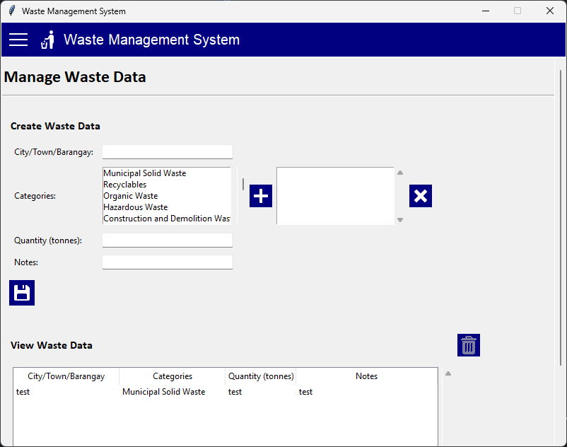
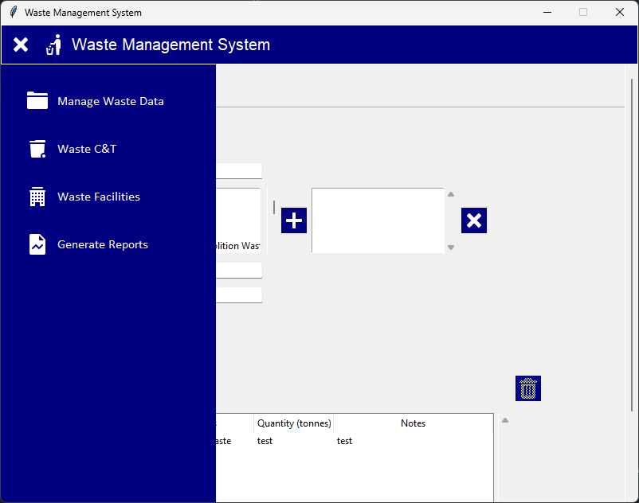
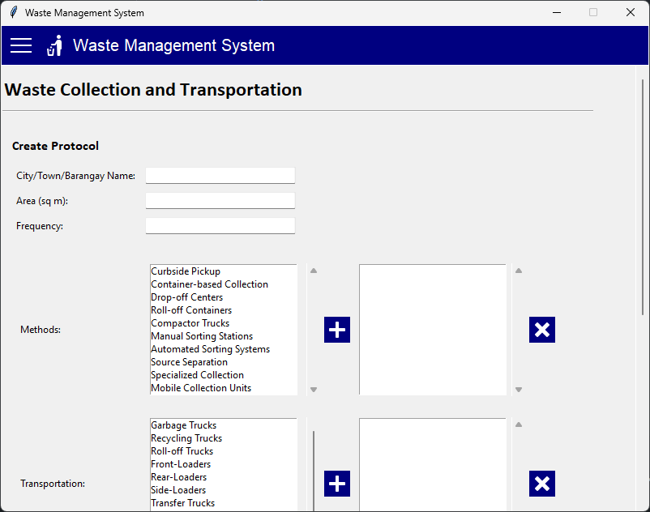
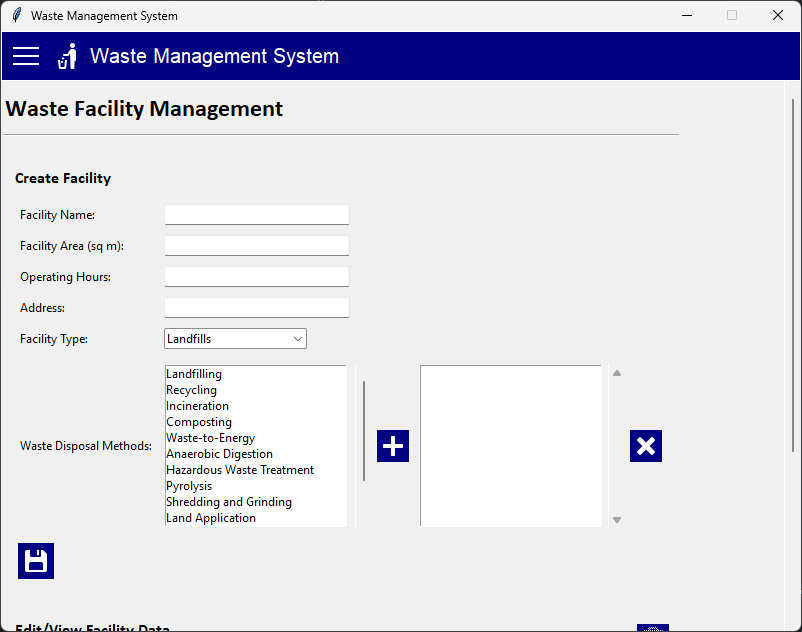
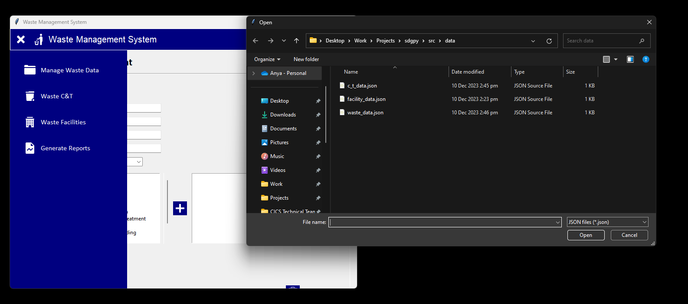
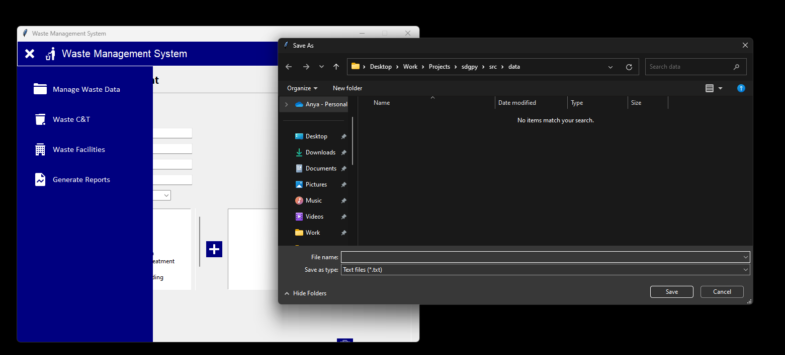

# sdg-py
Extremely basic Waste Management System using Tkinter.

## Project Overview

This `sdg-py` project was created to fulfill academic requirements, and in accordance with the Sustainable Development Goals.

## Project Status

**Note: Markdown is pending.**

## Features

- Create and Manage Waste Profiles

- Toggle Menu

- Create and Manage Waste Collection and Transportation Protocols

- Create and Manage Facility and Disposal Profiles

- Export json files as txt files

## Technologies Used

- Python
- Tkinter

## Prerequisites

- Python

> Icons by Icons8.

